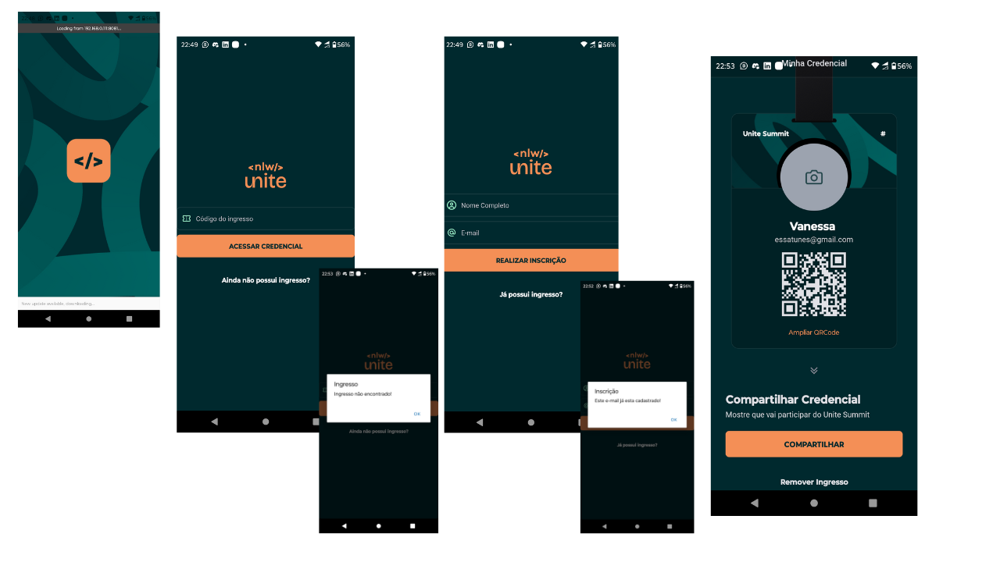

## Projeto Eventos Mobile NLW 

#### Este projeto foi realizado em um evento online com a Rocketseat, tanto a parte de backend e frontend mobile com 3 aulas cada.
#### Neste projeto se faz o cadastro de um evento, o cadastro dos participantes, gera a credencial com um Id, nome, e-mail dos participantes, tambem é possível colocar a foto e gerar um link de compartilhamento, podendo também excluir o evento ou o participante, ele verifica se o participante já está cadastrado, não permitindo o mesmo e-mail se cadastrar mais de uma vez, são várias funcionalidades.

